<div align="center">

# LMS

**A Learning Management System built with Django REST Framework and React.**

Teachers, students, courses, enrollments, lessons, assignments, submissions and
grades — each one a full CRUD screen behind a role-aware, token-authenticated API.

[](https://www.djangoproject.com/)
[](https://www.django-rest-framework.org/)
[](https://react.dev/)
[](https://vite.dev/)
[](https://tailwindcss.com/)
[](https://mariadb.org/)

</div>

---

## Contents

- [What it is](#what-it-is)
- [Screens](#screens)
- [Features](#features)
- [Architecture](#architecture)
- [Data model](#data-model)
- [Getting started](#getting-started)
- [Demo accounts](#demo-accounts)
- [Roles and permissions](#roles-and-permissions)
- [API reference](#api-reference)
- [Project layout](#project-layout)
- [Testing](#testing)
- [Troubleshooting](#troubleshooting)

---

## What it is

Two applications that talk over JSON:

- **`backend/`** — Django 5.2 + Django REST Framework. Owns the database, the
  JWT tokens and every rule about who may change what.
- **`frontend/`** — React 19 + Vite + Tailwind. Fifteen screens, no mock data.
  If the API is down the pages say so rather than inventing rows.

You sign in with a **phone number**, not a username. There is no public sign-up:
an admin creates accounts from inside the app.

---

## Screens

### Dashboard

Eight tiles, one per resource, each showing a live count read from the API and
linking through to its table.

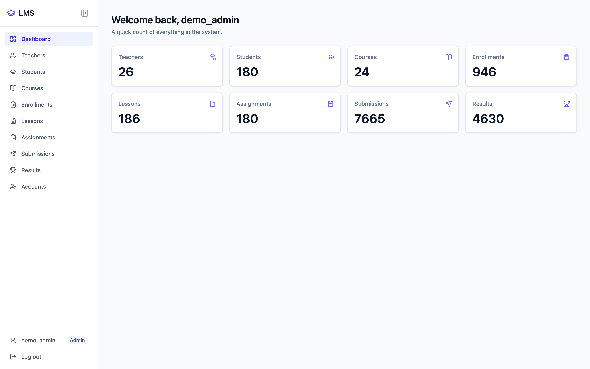

### Sign in

Phone number and password. In `npm run dev` the page also offers the seeded
local accounts as one-click buttons; that block is dropped from `npm run build`.

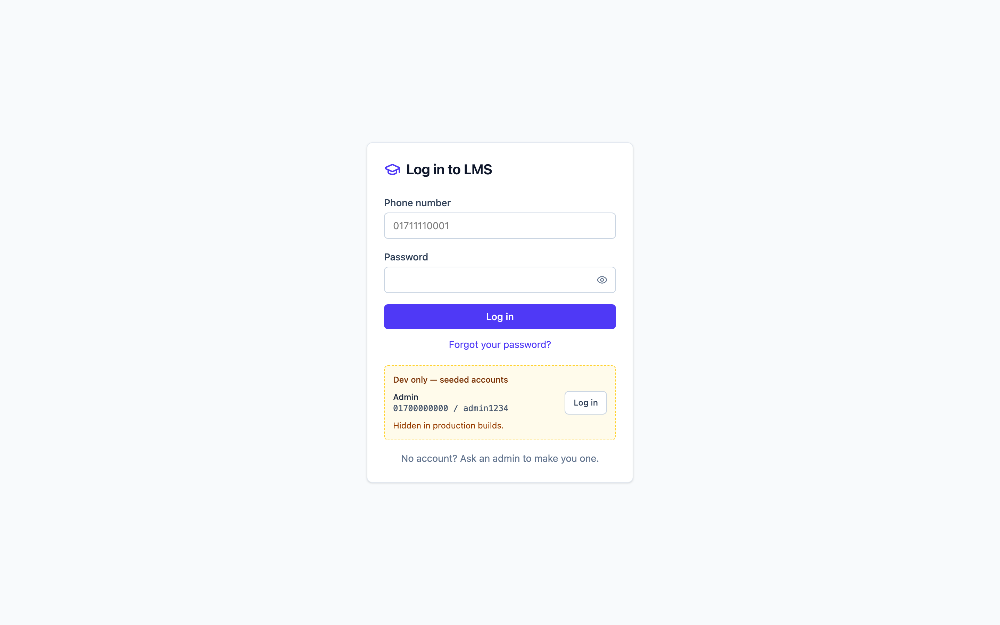

### Resource tables

Every one of the eight resources gets the same screen: search, dropdown filters,
sortable columns, a pager, and inline add / edit / delete.

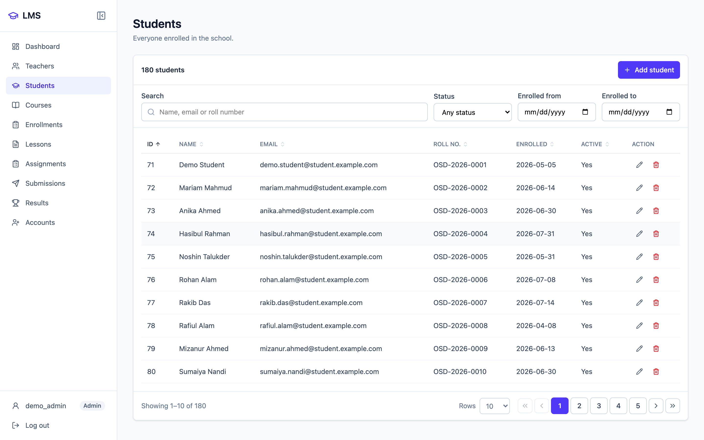

Searching, filtering, sorting and paging all happen **on the server** — the
browser never downloads a table it is not showing.

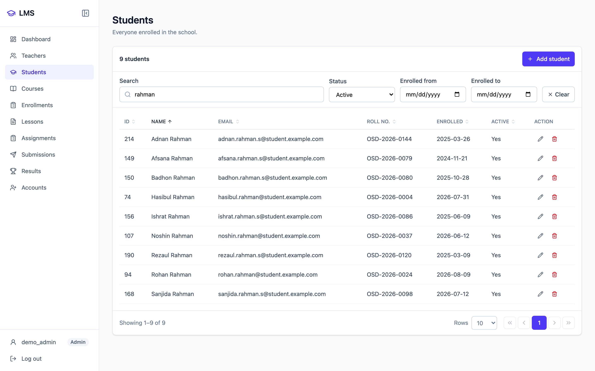

### Add and edit

The form opens in place above the table, empty for a new row or filled in for an
existing one.

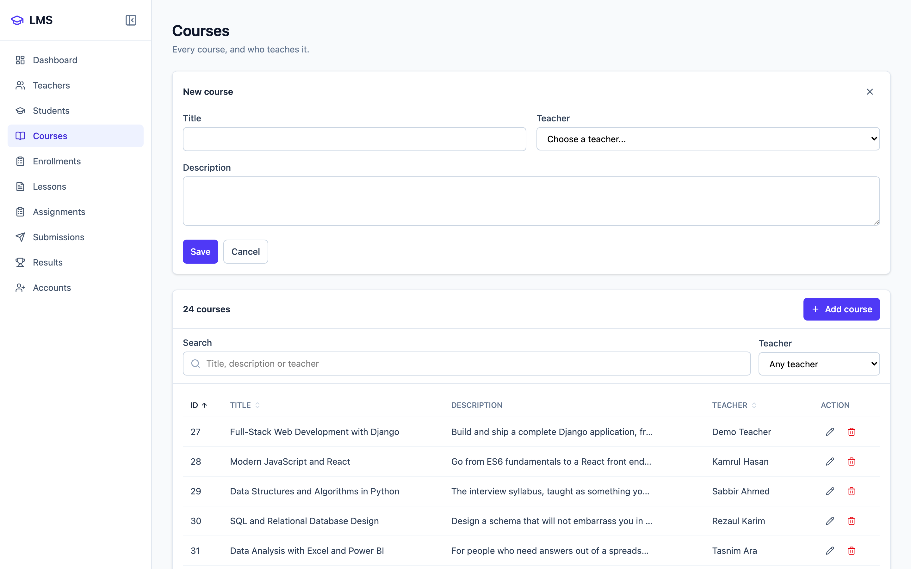

### Delete

Deleting asks first, naming the row it is about to remove.

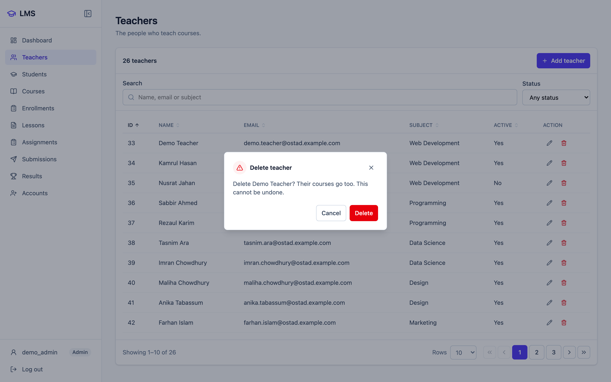

### Relationships

Rows that point at other rows — a course at its teacher, an assignment at its
lesson — are shown and picked by name, never by raw id.

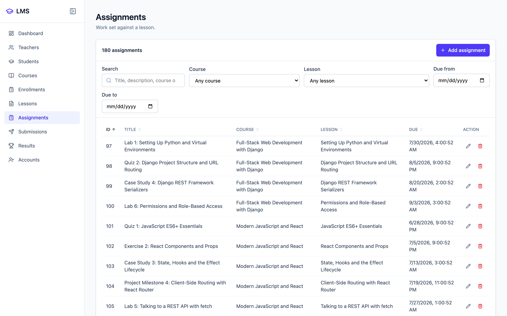

### Grading

Submissions come in against an assignment; results attach a score and feedback
to a submission.

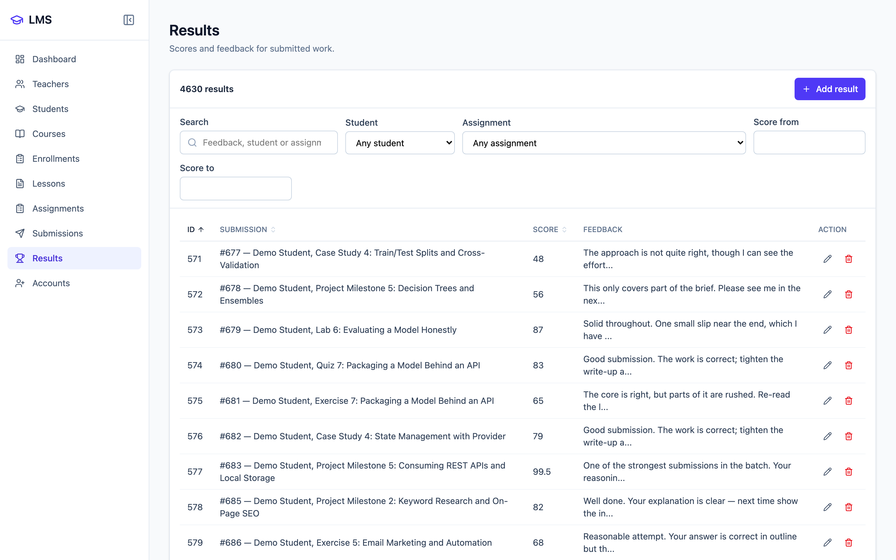

### Accounts (admin only)

Where a login is created, and where its role is set.

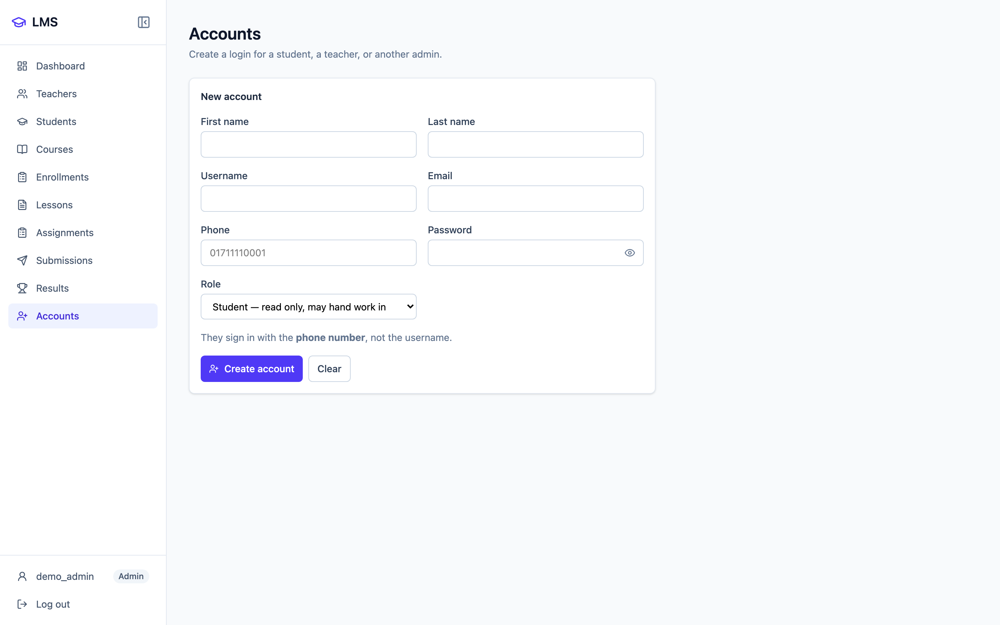

### Your profile

Your own name, email and phone, plus a password change that needs the old
password and signs you out afterwards.

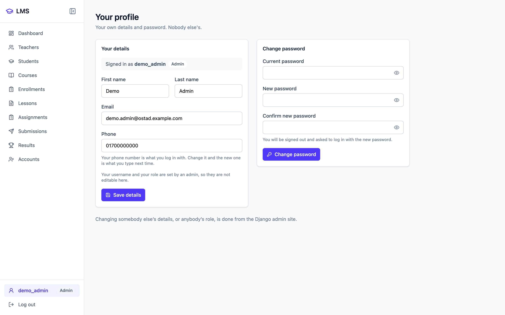

### Role-aware UI

The same page, signed in as a student: the sidebar drops Accounts, and every
add / edit / delete button is gone. The API refuses those calls too — hiding
the buttons is a courtesy, not the control.

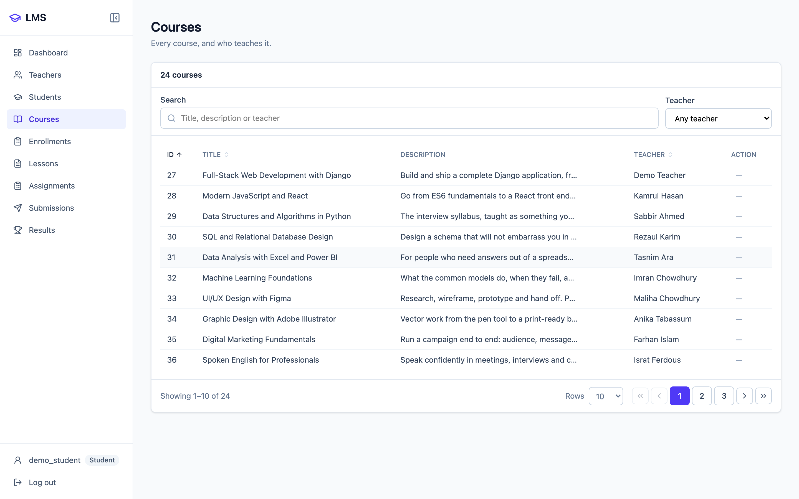

### Forgotten passwords

`/forgot-password` mails a link; `/reset-password` reads the `uid` and `token`
back off it. In development Django prints the mail to its own terminal.

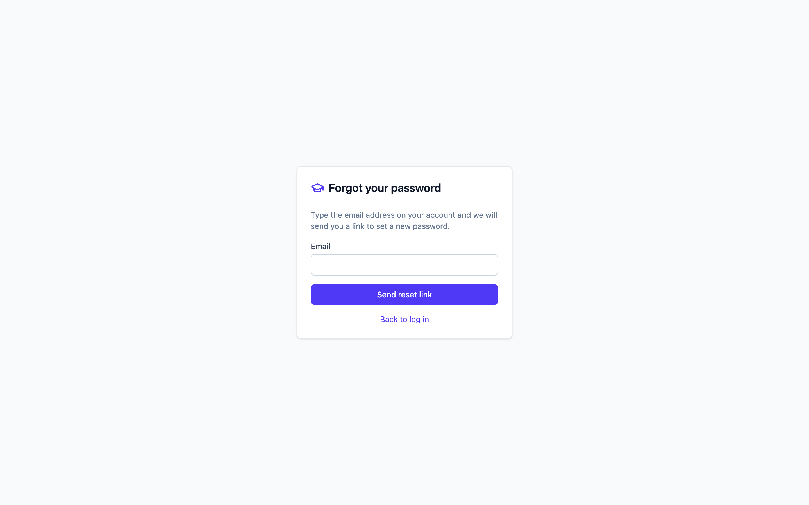

<details>
<summary><b>The rest of the tables</b></summary>

**Enrollments** — who is on which course, filterable by either end and by date.

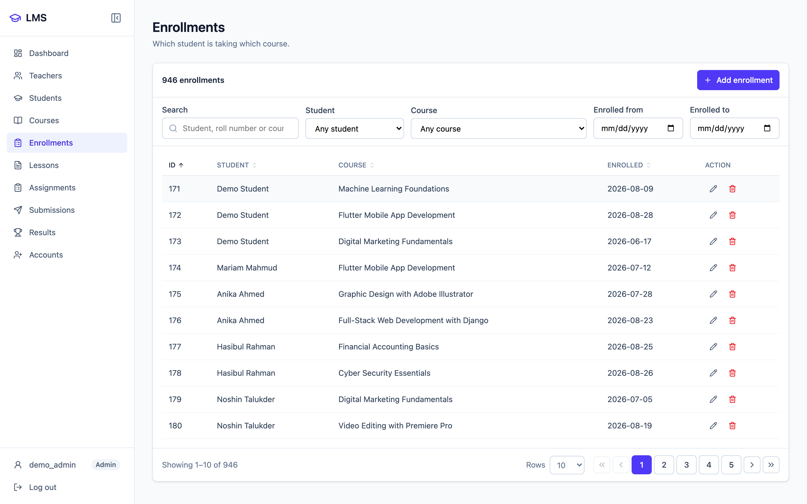

**Lessons** — the content of a course, in order.

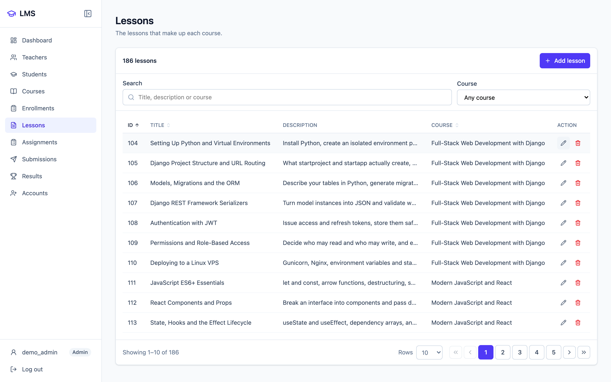

**Submissions** — work handed in, against an assignment and a student.

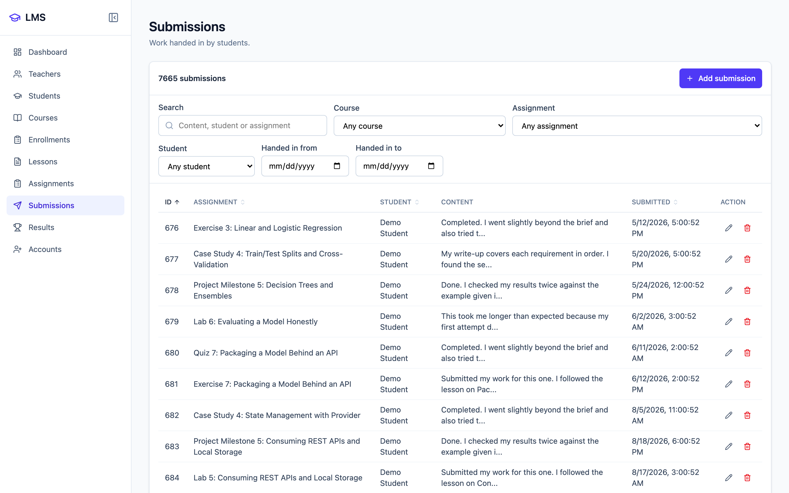

</details>

### On a phone

The sidebar becomes a drawer and the tables scroll sideways.

<p align="center">
  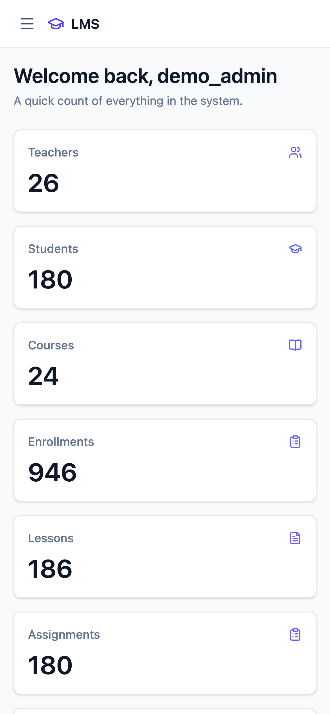
  &nbsp;&nbsp;
  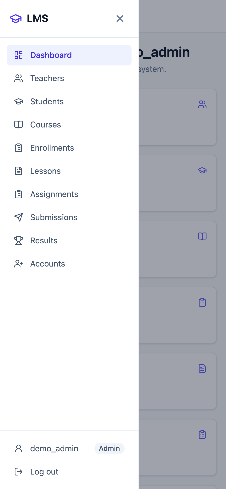
</p>

> Every image above is taken from the running app by
> [`docs/capture_screenshots.py`](docs/capture_screenshots.py). With both servers
> up and the database seeded, `python3 docs/capture_screenshots.py` redraws the
> lot.

---

## Features

**Authentication**
- JWT access + refresh tokens (`djangorestframework-simplejwt`), 8-hour access token
- Sign in by phone number; token kept in `localStorage`, so a refresh does not sign you out
- Change your own password — old password required, and every issued refresh token is blacklisted afterwards
- Forgot / reset password by emailed one-hour link
- No public sign-up: accounts are created by an admin, who picks the role

**Authorisation**
- Three roles — admin, teacher, student — stored on a `Profile` beside each `User`
- DRF defaults to `IsAuthenticated`, so a new view is locked until someone decides otherwise
- A superuser counts as an admin, so `createsuperuser` is always a way back in
- The frontend mirrors the rules in `src/permissions.js` purely to decide which buttons to draw

**Every list endpoint**
- `?search=` free text across the fields the view names
- `?<field>=` exact-value and range filters, declared per view
- `?ordering=name` / `?ordering=-name`
- `?page=` / `?page_size=` with a `{count, page, page_size, total_pages, next, previous, results}` envelope
- `select_related` on the views that join, so a page of rows is one query and not one per row

**Developer experience**
- `manage.py seed_data` fills the database with ~180 students, 24 courses, 7,600 submissions and 4,600 grades — and is idempotent, so running it twice adds nothing
- `scripts/api_smoke_test.py` drives every endpoint as all three roles over real HTTP, and counts an expected `403` as a pass

---

## Architecture

```
┌──────────────────────────┐         ┌──────────────────────────┐        ┌─────────────┐
│  React 19 + Vite         │  JSON   │  Django 5.2 + DRF        │  SQL   │  MySQL /    │
│  localhost:5180          │ ──────► │  127.0.0.1:8001          │ ─────► │  MariaDB    │
│                          │  Bearer │                          │        │  lms_db     │
│  api.js  ── one file for │  token  │  permissions.py  roles   │        │             │
│            every request │ ◄────── │  filters.py      ?field= │ ◄───── │             │
│  useTableQuery.js        │         │  pagination.py   ?page=  │        │             │
└──────────────────────────┘         └──────────────────────────┘        └─────────────┘
```

Three rules the codebase sticks to:

1. **The API is what enforces permissions.** The frontend hides buttons to match, but that is cosmetic.
2. **Every request the frontend makes lives in `src/api.js`.** Nothing else calls `fetch`.
3. **The eight table pages are the same page eight times** — same hook, same components, different columns.

---

## Data model

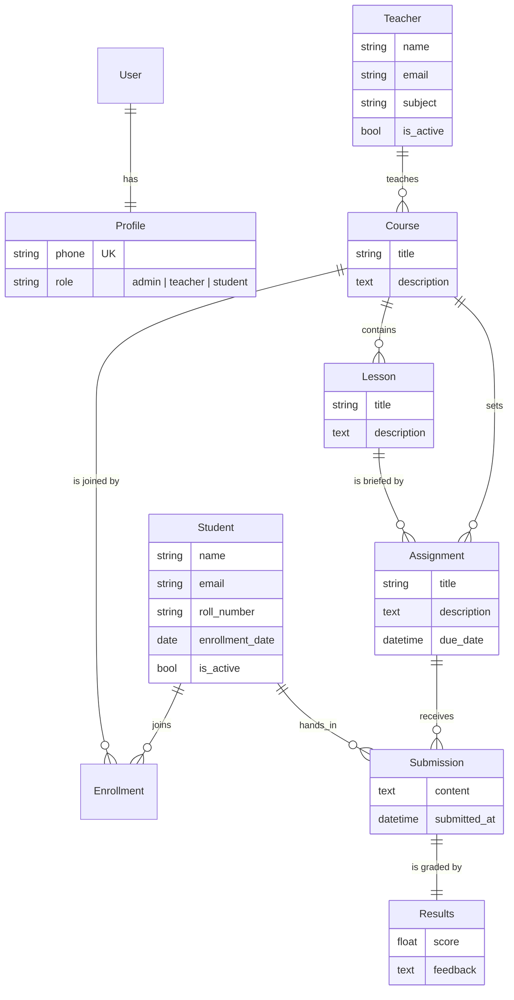
```mermaid
erDiagram
    User     ||--|| Profile    : "has"
    Teacher  ||--o{ Course     : teaches
    Course   ||--o{ Lesson     : contains
    Course   ||--o{ Assignment : sets
    Lesson   ||--o{ Assignment : "is briefed by"
    Student  ||--o{ Enrollment : joins
    Course   ||--o{ Enrollment : "is joined by"
    Assignment ||--o{ Submission : receives
    Student  ||--o{ Submission  : hands_in
    Submission ||--|| Results   : "is graded by"

    Profile {
        string phone UK
        string role  "admin | teacher | student"
    }
    Teacher {
        string name
        string email
        string subject
        bool   is_active
    }
    Student {
        string name
        string email
        string roll_number
        date   enrollment_date
        bool   is_active
    }
    Course {
        string title
        text   description
    }
    Lesson {
        string title
        text   description
    }
    Assignment {
        string   title
        text     description
        datetime due_date
    }
    Submission {
        text     content
        datetime submitted_at
    }
    Results {
        float score
        text  feedback
    }
```

One thing worth knowing: **nothing links a `Student` row to a `User` login.** They
are two separate tables, tied together only by email where the seeder puts them
there. That is why a student may hand a submission in but not edit one — the
server has no way to tell whose work it is.

---

## Getting started

### Prerequisites

| | Version | Notes |
| --- | --- | --- |
| Python | 3.11+ | tested on 3.14 |
| Node | 20+ | tested on 25 |
| MySQL or MariaDB | 8+ / 10.6+ | `mysqlclient` needs the client headers |

On macOS: `brew install mariadb pkg-config` then `brew services start mariadb`.

### 1. The database

```bash
mysql -u root -e "
  CREATE DATABASE lms_db CHARACTER SET utf8mb4;
  CREATE USER 'lms_user'@'127.0.0.1' IDENTIFIED BY 'lms_user_pw';
  GRANT ALL PRIVILEGES ON lms_db.* TO 'lms_user'@'127.0.0.1';
"
```

Those three names are the defaults in `backend/lms/settings.py`. Override them
with `DB_NAME`, `DB_USER`, `DB_PASSWORD`, `DB_HOST`, `DB_PORT` if yours differ.

### 2. The backend

```bash
cd backend
python -m venv venv && source venv/bin/activate     # Windows: venv\Scripts\activate
pip install -r requirements.txt

python manage.py migrate
python manage.py seed_data                          # sample data + demo logins
python manage.py runserver 8001
```

The API is now on <http://127.0.0.1:8001/api/> and Django admin on
<http://127.0.0.1:8001/admin/>.

> No admin account yet? `python manage.py createsuperuser` — a superuser counts
> as an admin everywhere in this codebase.

### 3. The frontend

```bash
cd frontend
npm install
npm run dev
```

Open <http://localhost:5180>.

To point it somewhere else, copy `.env.example` to `.env.local` and set
`VITE_API_URL`. Whatever origin you serve from also has to be in
`CORS_ALLOWED_ORIGINS` in `backend/lms/settings.py`, or the browser blocks the
call before it leaves.

### Seeding options

```bash
python manage.py seed_data                  # top up whatever is missing
python manage.py seed_data --fresh          # wipe seeded rows first
python manage.py seed_data --students 400   # a bigger cohort
```

Every "does this row exist yet" decision is derived from the ids involved rather
than from a random stream, so a second run is a no-op and a student who had
handed in four of six assignments still has four of six afterwards.

---

## Demo accounts

Created by `seed_data`, and repaired on every run so the login buttons always work.

| Role | Phone | Password |
| --- | --- | --- |
| Admin | `01700000000` | `admin1234` |
| Teacher | `01700000001` | `teacher1234` |
| Student | `01700000002` | `student1234` |

These are development fixtures. They exist in whatever database you point at, so
do not seed a real one.

---

## Roles and permissions

| | Admin | Teacher | Student |
| --- | :---: | :---: | :---: |
| Teachers, Students | add, edit, delete | read | read |
| Courses, Lessons, Assignments | add, edit, delete | add, edit, delete | read |
| Enrollments, Results | add, edit, delete | add, edit, delete | read |
| Submissions | add, edit, delete | add, edit, delete | **hand in only** |
| Accounts (create logins) | yes | — | — |
| Own profile and password | yes | yes | yes |

Enforced by `backend/backend/permissions.py`. Mirrored — for button visibility
only — in `frontend/src/permissions.js`. Change one, change the other.

---

## API reference

Base URL `http://127.0.0.1:8001/api`. Every endpoint except the four public ones
wants `Authorization: Bearer <access token>`.

### Auth

| Method | Path | Who | What |
| --- | --- | --- | --- |
| `POST` | `/login/` | public | `{phone, password}` → user, role and `tokens.access` / `tokens.refresh` |
| `POST` | `/register/` | **admin** | create a login; `role` defaults to `student` |
| `GET` | `/profile/` | any signed-in | your own account |
| `PATCH` | `/profile/` | any signed-in | change your name, email or phone |
| `POST` | `/change-password/` | any signed-in | `{current_password, new_password, confirm_password}` |
| `POST` | `/password-reset/` | public | `{email}` → mails a link; always answers 200 |
| `POST` | `/password-reset-confirm/` | public | `{uid, token, new_password, confirm_password}` |

### Resources

Each of these has a list route and a detail route:

```
GET|POST        /api/<resource>/
GET|PUT|PATCH|DELETE  /api/<resource>/<id>/
```

| Resource | Path | Writable by |
| --- | --- | --- |
| Teachers | `/teacher/` | admin |
| Students | `/student/` | admin |
| Courses | `/course/` | admin, teacher |
| Enrollments | `/enrollment/` | admin, teacher |
| Lessons | `/lesson/` | admin, teacher |
| Assignments | `/assignment/` | admin, teacher |
| Submissions | `/submission/` | admin, teacher (students may `POST`) |
| Results | `/results/` | admin, teacher |

> Note the naming: `/submission/` is singular but `/results/` is plural.

### Query parameters

Every list route accepts:

| Parameter | Example | Meaning |
| --- | --- | --- |
| `search` | `?search=nusrat` | free text over that view's `search_fields` |
| `ordering` | `?ordering=-due_date` | sort; leading `-` is descending |
| `page` | `?page=3` | which page |
| `page_size` | `?page_size=50` | rows per page, capped at 200 |

Plus the filters each view declares:

| Resource | Filters |
| --- | --- |
| Teachers | `is_active`, `subject` |
| Students | `is_active`, `enrolled_from`, `enrolled_to` |
| Courses | `teacher` |
| Enrollments | `student`, `course`, `enrolled_from`, `enrolled_to` |
| Lessons | `course` |
| Assignments | `course`, `lesson`, `due_from`, `due_to` |
| Submissions | `assignment`, `student`, `course`, `submitted_from`, `submitted_to` |
| Results | `submission`, `student`, `assignment`, `score_min`, `score_max` |

### The list envelope

```jsonc
GET /api/student/?search=nusrat&is_active=true&ordering=name&page=2

{
  "count": 214,          // rows matching the filters, not rows on this page
  "page": 2,
  "page_size": 10,
  "total_pages": 22,
  "next": "http://127.0.0.1:8001/api/student/?page=3&...",
  "previous": "http://127.0.0.1:8001/api/student/?page=1&...",
  "results": [ /* ... */ ]
}
```

### A worked example

```bash
TOKEN=$(curl -s -X POST http://127.0.0.1:8001/api/login/ \
  -H 'Content-Type: application/json' \
  -d '{"phone":"01700000000","password":"admin1234"}' \
  | python3 -c 'import sys,json; print(json.load(sys.stdin)["tokens"]["access"])')

# Assignments due in the next fortnight, soonest first
curl -s -H "Authorization: Bearer $TOKEN" \
  "http://127.0.0.1:8001/api/assignment/?due_from=2026-09-02&due_to=2026-09-16&ordering=due_date"
```

---

## Project layout

```
lms/
├── backend/
│   ├── lms/                     project settings, root urls, wsgi/asgi
│   ├── backend/                 the one app
│   │   ├── models.py            Profile, Teacher, Student, Course, Lesson,
│   │   │                        Assignment, Enrollment, Submission, Results
│   │   ├── serializers.py       validation, including the password rules
│   │   ├── views.py             generics.ListCreate / RetrieveUpdateDestroy
│   │   ├── permissions.py       who may write what  ← the security rules
│   │   ├── filters.py           ?field= and ?from=/?to= support
│   │   ├── pagination.py        the {count, results, ...} envelope
│   │   ├── seed_catalog.py      names, courses and feedback the seeder draws on
│   │   └── management/commands/seed_data.py
│   ├── scripts/api_smoke_test.py
│   └── requirements.txt
│
└── frontend/
    ├── src/
    │   ├── api.js               every call to the backend, and the session
    │   ├── auth.js              the auth context and its useAuth() hook
    │   ├── permissions.js       role rules, for button visibility only
    │   ├── useTableQuery.js     page / search / sort / filter state, once
    │   ├── App.jsx              the routes
    │   ├── Sidebar.jsx          the menu and the frame around signed-in pages
    │   ├── components/          Table, Pagination, FilterBar, Alert, Input, ...
    │   └── pages/               one file per screen
    ├── vite.config.js
    └── .env.example
```

**Read it in this order:** `backend/backend/models.py` → `permissions.py` →
`views.py`, then `frontend/src/api.js` → `pages/Teachers.jsx` (the simplest full
page; the other seven are the same shape).

---

## Testing

```bash
cd backend
python manage.py runserver 8001        # in one terminal
python scripts/api_smoke_test.py       # in another
```

This is not a unit test suite — it talks HTTP to a real server with a real
database, which is the only way to catch a permission class wired to the wrong
view or a route that was never added to `urls.py`. Every check states the status
code it expects, and a check that expects `403` passes only on `403`: the
permission rules are part of what "working" means. Anything it creates, it
deletes on the way out.

```bash
cd frontend
npm run lint
npm run build
```

---

## Troubleshooting

| Symptom | Cause | Fix |
| --- | --- | --- |
| `Could not reach the server` in the browser | Django is not running, or is on another port | `python manage.py runserver 8001` |
| CORS error in the console | Your origin is not allowed | add it to `CORS_ALLOWED_ORIGINS` in `backend/lms/settings.py` |
| `pip install mysqlclient` fails | Missing MySQL client headers | `brew install mysql-client pkg-config` (macOS), `apt install libmysqlclient-dev` (Debian) |
| `Only an admin can create accounts.` | You are signed in as a teacher or student | use an admin, or `python manage.py createsuperuser` |
| Reset email never arrives | Dev mail backend prints instead of sending | copy the link out of the Django terminal |
| Signed out straight after changing your password | Deliberate — issued tokens are blacklisted | log in again with the new password |
| Vite says the port is taken | 5180 is busy | it picks the next free port and prints it; add that origin to CORS |

---

## Notes

`DEBUG = True`, a committed `SECRET_KEY` and the demo passwords above make this
a development configuration. Before it faces anything real: move the secret key
and the database credentials to the environment, turn `DEBUG` off, set
`ALLOWED_HOSTS`, and delete the seeded accounts.
